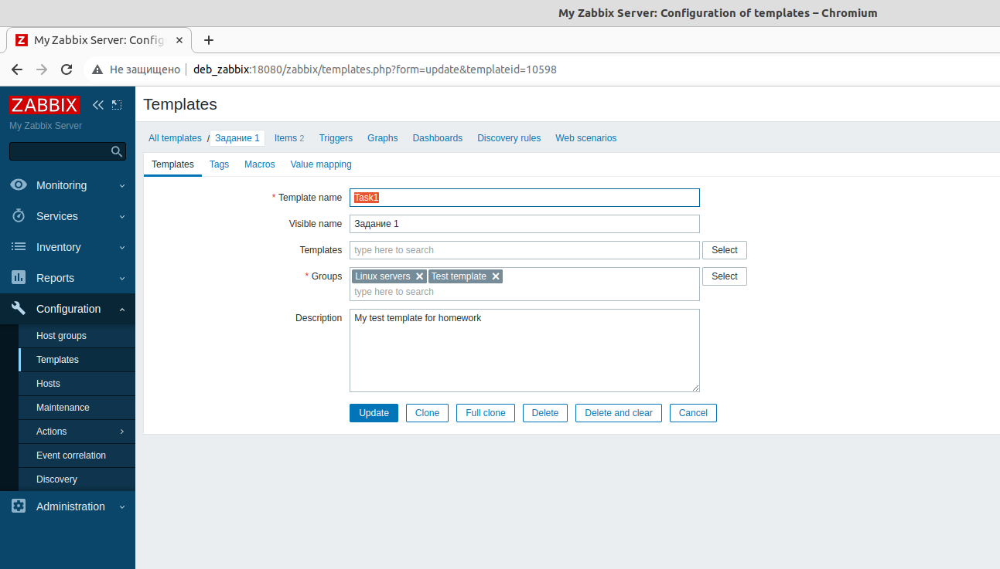
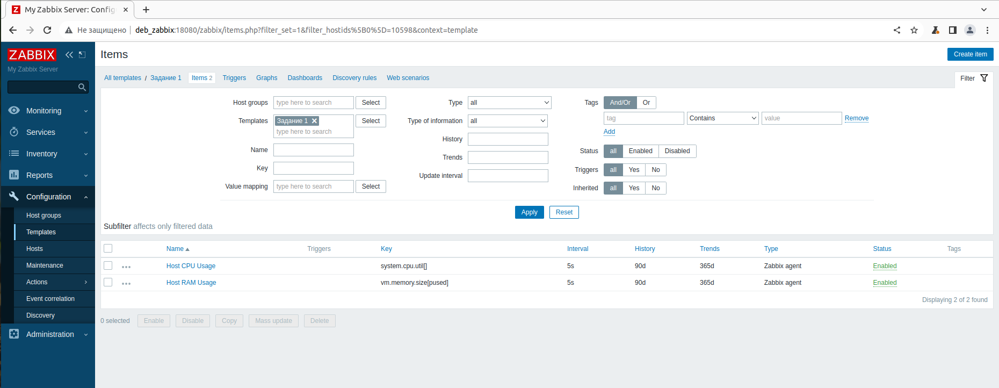
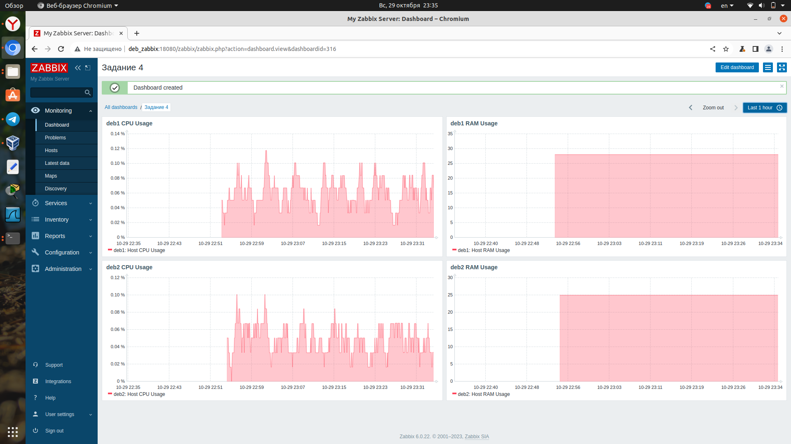

# Домашнее задание к занятию "`Система мониторинга Zabbix. Часть 2`" - `Аблогин Павел`

### Инструкция по выполнению домашнего задания

   1. Сделайте `fork` данного репозитория к себе в Github и переименуйте его по названию или номеру занятия, например, https://github.com/имя-вашего-репозитория/git-hw или  https://github.com/имя-вашего-репозитория/7-1-ansible-hw).
   2. Выполните клонирование данного репозитория к себе на ПК с помощью команды `git clone`.
   3. Выполните домашнее задание и заполните у себя локально этот файл README.md:
      - впишите вверху название занятия и вашу фамилию и имя
      - в каждом задании добавьте решение в требуемом виде (текст/код/скриншоты/ссылка)
      - для корректного добавления скриншотов воспользуйтесь [инструкцией "Как вставить скриншот в шаблон с решением](https://github.com/netology-code/sys-pattern-homework/blob/main/screen-instruction.md)
      - при оформлении используйте возможности языка разметки md (коротко об этом можно посмотреть в [инструкции  по MarkDown](https://github.com/netology-code/sys-pattern-homework/blob/main/md-instruction.md))
   4. После завершения работы над домашним заданием сделайте коммит (`git commit -m "comment"`) и отправьте его на Github (`git push origin`);
   5. Для проверки домашнего задания преподавателем в личном кабинете прикрепите и отправьте ссылку на решение в виде md-файла в вашем Github.
   6. Любые вопросы по выполнению заданий спрашивайте в чате учебной группы и/или в разделе “Вопросы по заданию” в личном кабинете.
   
Желаем успехов в выполнении домашнего задания!
   
### Дополнительные материалы, которые могут быть полезны для выполнения задания

1. [Руководство по оформлению Markdown файлов](https://gist.github.com/Jekins/2bf2d0638163f1294637#Code)

---

### Задание 1

1. `Создан шаблон с названием "Задание 1"`
2. `Созданы итемы для метрик загрузки CPU и загрузки RAM`

`Скриншоты выполнения задания`

---

### Задание 2

1. `Установлен Zabbix Agent на виртуальные машины deb1 и deb2`
2. `Zabbix Server добавлен в список разрешенных серверов Zabbix Agents`
3. `Zabbix Agents добавил в раздел Configuration - Hosts на Zabbix Server`
4. `За хостами прикреплен шаблон Linux by Zabbix Agent`
5. `В разделе Latest Data появляются данные с добавленных агентов (приложил скриншот)`

`

---

### Задание 3

1. `В настройках хостов прикрепил шаблоны "Задание 2-3" и Linux by Zabbix Agent`

### Задание 4

1. `В разделе Dashboards создал новый дашборд с названием "Задание 4"`
2. `На новом дашборде разместил графики загрузки CPU и RAM для хостов deb1, deb2`

